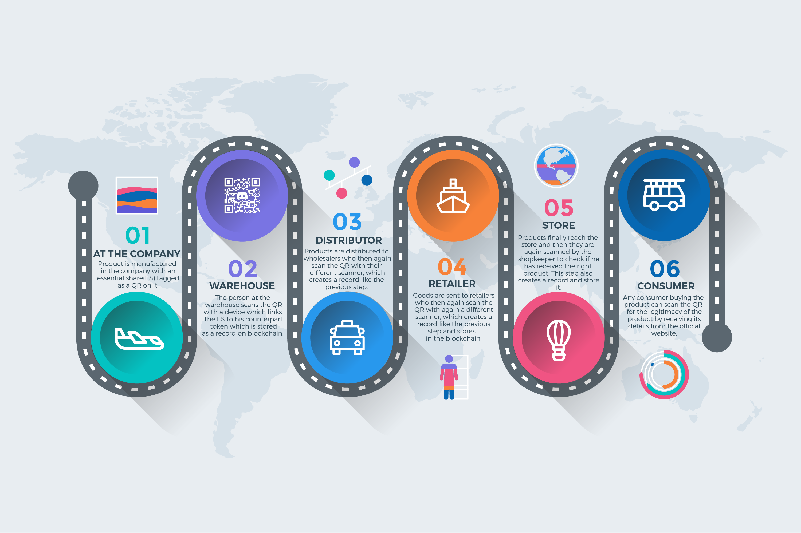

# NFT Based Product Authentication System

## Project Overview
Consumers usually prefer a product with cheaper price given the product has an acceptable quality. 
Using this insight, scammers or even the factory with the knowledge of producing the same type of product will try to produce a counterfeit product trying to achieve a lower price than the market to gain sales. 
Hence we have proposed "NFT-Based Product Authentication System" which is a application designed to ensure the authenticity of pharmaceutical products in their supply chain using Non-Fungible Tokens (NFTs). Each product is linked to a unique NFT stored on a blockchain, allowing consumers and businesses to verify the authenticity and ownership of prod

## Highlights
- An NFT Token is created out the product details which is splitted into Essential Share(ES) and many Non-Essential Shares.
- The ES is shared with the manufacturer which is then converted to a QR Code which is pasted to the product.
- The NES is shared with the rest of the supply chain members.
- At all stages the members scan the QR Code to link the ES with the NES.
- If the combination matches, a verified page will be shown with the existing product history made of product id and timestamp at which the product was successfully authenticated.
- If the combination doesn’t match, the process will stop there itself and the fake product is announced.
- The customer can scan the QR Code to view the product history.

## STAGE A (MANUFACTURER)
- The manufacturer will signup into our website after which he will be asked to sign in.
- After the sign in process is validated, he will be shared with a PRIVATE SHARE for two-factor authentication through which he can proceed to the next phase.
- The manufacturer will then be redirected to the company registration page.
- He chooses between 'Registered' or 'Not Registered.' If not, he needs to add company details first; otherwise, he can proceed to add product details.
- On clicking the upload button, the product details will be submitted back to the backend.

## STAGE B (DISTRIBUTOR, RETAILER, WHOLESALER)
- They will  also signup into our website after which they will be asked to sign in. After the sign in process is validated, they too will be shared with a PRIVATE SHARE for two-factor authentication through which they can proceed to the next phase.
- These recipients will then scan the QR and then they will be redirected to a page where they will have to put the NES.
- They will receive their respective NES in their respective Knuct wallet-chat sent by their manufacturer.
- The NES put will be recombined with ES associated to the QR to check the product’s authenticity.
- If the combination matches, a verified page will be shown with the existing product history made of product id and timestamp at which the product was successfully authenticated.
- If the combination doesn’t match, the process will stop there itself and the fake product is identified.

## STAGE C (CONSUMER)
- The consumer can scan the QR code to access  the history of the product in the supply chain alongwith with location and timestamp details at each stage.

## Contributing
Contributions are welcome! If you have suggestions or improvements, please create a pull request or open an issue.
